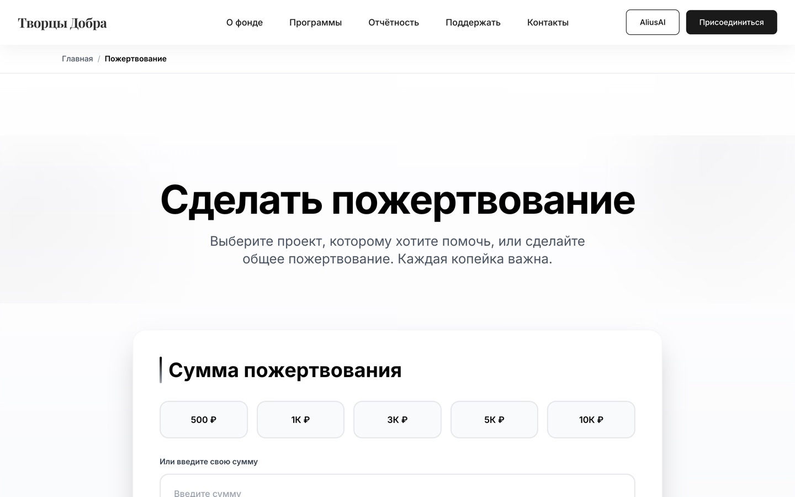

# 🌟 ТворцыДобра — Donation Platform for Nonprofits

**Connecting NGOs, volunteers, and donors through secure payments and transparent interface.**

## 🚀 Live Demo

- **Frontend (Vercel):** https://frontend-i0plt0ogu-nknpro.vercel.app ✅ **DEPLOYED**
- **Backend:** Available on Railway/Render with PostgreSQL  
- **Demo Admin:** `admin@tvorcydobra.ru` / `demo-admin-12345`

<table>
  <tr>
    <td width="50%"></td>
    <td width="50%"></td>
  </tr>
  <tr>
    <td width="50%"></td>
    <td width="50%"></td>
  </tr>
</table>

> ⚠️ **Screenshots**: Images in `.github/assets/` are placeholders. Replace them with actual captures from the deployed site when ready.

---

## ⚡ Features

| Feature | Description |
|---------|-------------|
| 💳 **Payment Integration** | Stripe, PayPal, ЮKassa with PCI-DSS compliance |
| 📊 **NGO Dashboard** | Real-time analytics, fund tracking, donor management |
| 🔐 **Admin Panel** | NGO verification, document moderation, platform settings |
| 🌍 **Multi-Currency** | ₽ RUB, $ USD, € EUR, ₸ KZT support |
| 📱 **Responsive Design** | Optimized for mobile, tablet, desktop |
| 🎯 **SEO Optimized** | Metadata, Open Graph, structured JSON-LD data |

---

## 🛠 Tech Stack & Architecture

### Fullstack Overview

| Layer | Technology | Version | Purpose |
|-------|-----------|---------|---------|
| **Frontend** | Next.js | 14.x | App Router, Server Components |
| **UI Library** | React | 18.x | Component framework |
| **Styling** | Tailwind CSS | 3.x + shadcn/ui | Utility-first styling |
| **Backend** | NestJS | 10.x | Modular TypeScript framework |
| **ORM** | Prisma | 6.x | Type-safe database access |
| **Database** | PostgreSQL | 15.x | Primary data store |
| **Auth** | JWT + OAuth2 | - | Secure session management |
| **Payments** | Stripe/PayPal/YuKassa | API v3 | Payment processing |
| **Deployment** | Vercel/Railway | - | CI/CD pipeline |

### Frontend Structure (`frontend/`)

```
frontend/
├── app/                              # Next.js App Router
│   ├── (auth)/                       # Authentication flows
│   │   ├── login/page.tsx            # Sign-in page
│   │   ├── register/page.tsx         # User registration  
│   │   └── verify/[id]/page.tsx      # Email verification
│   ├── (public)/                     # Public marketing pages
│   │   ├── page.tsx                  # Homepage with hero, featured projects
│   │   ├── about/page.tsx            # About platform mission
│   │   └── help/page.tsx             # FAQ and support info
│   ├── ngo-dashboard/                # NGO-specific dashboard
│   │   ├── page.tsx                  # Main analytics view
│   │   ├── projects/page.tsx         # Project management
│   │   └── donations/page.tsx        # Donor transactions log
│   ├── donation/[projectId]/         # Single project page
│   │   └── page.tsx                  # Fundraising campaign with progress
│   ├── api/                          # Next.js API routes (proxy to backend)
│   └── globals.css                   # Global styles + Tailwind directives
├── components/                       # React component library
│   ├── ui/                           # shadcn/ui primitives
│   │   ├── button.tsx                # Reusable button variants
│   │   ├── card.tsx                  # Card container
│   │   ├── input.tsx                 # Form inputs
│   │   └── dialog.tsx                # Modal dialogs
│   ├── donation/                     # Donation-specific components
│   │   ├── donation-form.tsx         # Amount selection + payment method
│   │   ├── payment-methods.tsx       # Stripe Elements wrapper
│   │   ├── donation-confirmation.tsx # Post-payment receipt
│   │   └── progress-bar.tsx          # Fundraising goal visualization
│   ├── ngo/                          # NGO dashboard widgets
│   │   ├── total-donations-card.tsx  # Revenue summary
│   │   ├── monthly-trend-chart.tsx   # Recharts visualization
│   │   ├── active-projects-table.tsx # Project status list
│   │   └── top-donors-list.tsx       # Leaderboard component
│   └── layout/                       # Shared layouts
│       ├── navbar.tsx                # Navigation bar
│       ├── footer.tsx                # Footer with links
│       └── auth-provider.tsx         # Auth context provider
├── lib/                              # Utility modules
│   ├── stripe.ts                     # Stripe integration helpers
│   ├── api-client.ts                 # Axios instance with interceptors
│   ├── currency.ts                   # Multi-currency formatting
│   └── utils.ts                      # Common utilities
└── public/
    └── images/                       # Static assets (logos, banners)
```

### Backend Structure (`backend/`)

```
backend/
├── src/
│   ├── modules/                      # Feature modules (NestJS standard)
│   │   ├── auth/                     # Authentication & authorization
│   │   │   ├── auth.controller.ts    # Login/register endpoints
│   │   │   ├── auth.service.ts       # JWT generation, OAuth strategies
│   │   │   └── guards/               # Role-based guards (user/ngo/admin)
│   │   ├── ngo/                      # NGO organization management
│   │   │   ├── ngo.controller.ts     # CRUD operations
│   │   │   ├── ngo.service.ts        # Verification logic
│   │   │   └── dto/                  # Validation DTOs
│   │   ├── projects/                 # Campaign/project management
│   │   │   ├── projects.controller.ts
│   │   │   ├── projects.service.ts   # Project lifecycle logic
│   │   │   └── categories.service.ts # Category/tag system
│   │   ├── donations/                # Payment processing module
│   │   │   ├── donations.controller.ts
│   │   │   ├── donations.service.ts  # Create transaction, webhooks
│   │   │   ├── stripe-webhook.ts     # Stripe event handler
│   │   │   ├── paypal-webhook.ts     # PayPal IPN handler
│   │   │   └── yukassa-webhook.ts    # YuKassa callback processor
│   │   └── admin/                    # Super admin panel endpoints
│   │       ├── admin.controller.ts
│   │       ├── admin.service.ts      # Moderation queue, audit logs
│   │       └── verification.pipe.ts  # NGO document validation
│   ├── common/                       # Cross-cutting concerns
│   │   ├── decorators/               # Custom decorators
│   │   │   ├── roles.decorator.ts    # @Roles('admin') helper
│   │   │   └── user.decorator.ts     # @CurrentUser() decorator
│   │   ├── filters/                  # Exception filters
│   │   │   └── http-exception.filter.ts
│   │   ├── pipes/                    # Validation pipes
│   │   │   └── validate-money.pipe.ts
│   │   └── interceptors/             # Response interceptors
│   ├── config/                       # Environment configuration
│   │   └── validators.ts             # Joi/Zod env var validation
│   └── main.ts                       # Entry point + global middleware
├── prisma/
│   ├── schema.prisma                 # Database schema (26 models)
│   └── migrations/                   # Migration files
└── test/                             # Integration tests
    ├── auth.e2e-spec.ts              # Login/signup E2E tests
    └── donations.e2e-spec.ts         # Payment flow tests
```

---

## 📦 Installation & Setup

### Quick Start (Development)

```bash
# Clone repository
git clone https://github.com/NikitaKoreshkov/tvorcy-dobra.git
cd tvorcy-dobra

# Install all dependencies (frontend + backend + dev tools)
npm run install:all

# Start development environment (both frontend and backend)
npm run dev

# Services available at:
# Frontend: http://localhost:3000
# Backend:  http://localhost:3001
```

See `.env.example` for complete environment variable configuration.

---

## 💝 Every donation matters!

*Live Demo: https://frontend-i0plt0ogu-nknpro.vercel.app*

*© 2026 ТворцыДобра. Built with ❤️ using Next.js, NestJS, and passion for good.*
