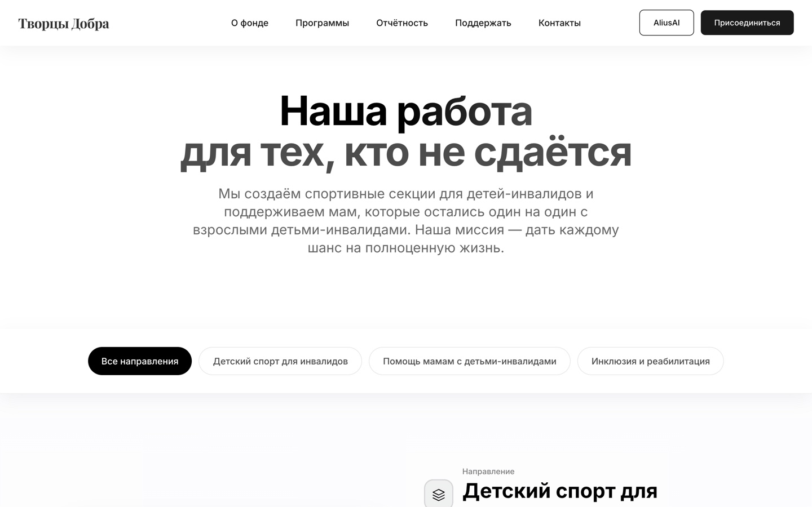

<div align="center">

# ТворцыДобра — donation platform

**A donation platform as it actually gets built: a NestJS core with a real ledger,
recurring subscriptions, gamification and i18n — and an honest line where the payment
processor would start.**
25 frontend pages, 14 entities, 9 controllers, Russian and English, argon2id
passwords, throttled and geo-aware auth.

**Frontend demo:** [tvorcy-dobra.vercel.app](https://tvorcy-dobra.vercel.app)


</div>

---

<table>
  <tr>
    <td width="50%"></td>
    <td width="50%"></td>
  </tr>
  <tr>
    <td></td>
    <td align="center"></td>
  </tr>
</table>

## The problem

A donation platform looks simple from the outside and is a small bank on the inside:
money has to be attributable to a programme, recurring gifts have to be cancellable,
a donor wants a receipt, and an NGO wants to know whether a sum actually arrived.

This build takes that seriously in the parts that are free to take seriously —
the ledger, subscriptions, verification, i18n — and is explicit about the part that
is not: **there is no payment processor here.**

## What this is (and what it isn't)

**It is a two-app monorepo.** `frontend/` is Next.js 14 (App Router, Tailwind,
`next-intl`, `framer-motion`, `google-auth-library`). `backend/` is NestJS on
TypeORM and PostgreSQL. They are independent deployables; the Vercel demo above runs
the frontend, and the backend is not deployed publicly.

**It is not Prisma, and not shadcn/ui.** Earlier revisions of this README claimed
`Prisma 6.x`, `shadcn/ui`, `Stripe/PayPal/ЮKassa` and `PCI-DSS compliance`. None of
that is in the code: the ORM is TypeORM, the UI is hand-written Tailwind (16,950
lines of CSS), and there is no payment SDK of any kind. The claims are removed here
rather than softened, because a README that overstates a payment story is worse than
one that admits the gap.

**There is no money movement.** `payments/` is a *card profile* store, not a
processor. See the next section for exactly what it does and does not do.

## The payment question, answered precisely

```
AddCardDto { cardNumber, cvv, expiryMonth, expiryYear, cardholderName }
   │
   ├─ Luhn check, brand detection (visa / mastercard / mir / amex / other)
   ├─ CVV length check per brand, expiry check
   ├─ stored:  cardType · last4 · expiryMonth · expiryYear · cardholderName · isDefault
   ├─ stored:  token = argon2id(`${cardNumber}-${cvv}-${userId}-${Date.now()}`)
   ├─ stored:  fingerprint = sha256(`${pan}-${userId}`)   ← duplicate-card detection
   └─ NOT stored: the PAN, the CVV
```

The right property holds: a raw card number and CVV never reach the database, and
`payment_methods` keeps only the last four digits. The honest caveat: that `token`
is a one-way hash, not a processor token, so **nothing can be charged with it** — and
hashing a PAN is not tokenization. A real integration replaces `generateToken()` with
a call to an acquirer's tokenization endpoint and deletes the client-side card form
in favour of a hosted fields widget. Until then the platform's donations are
recorded as transactions, not collected.

## The map

```
 frontend/  Next.js 14 · 25 pages · 36 424 lines
   (auth)/ login · register · verify/[id]
   (public)/ home · about · help
   ngo-dashboard/ · ngo-dashboard/projects · ngo-dashboard/donations
   donation/[projectId]/
   messages/{ru,en}.json · next-intl · framer-motion

 backend/  NestJS · TypeORM · 9 604 lines · 14 entities · 9 controllers
   auth/           argon2id passwords, passport-jwt, verification codes,
                   login-attempt tracking, geoip-lite, throttler, helmet
   projects/       campaigns, project-translation (ru/en per project)
   transactions/   one-time donation · recurring payments (update/cancel) ·
                   stats · dashboard data · receipt HTML · project total update
   subscriptions/  initializePlans() · available plans · create · cancel
   payments/       card profiles (see above) — no processor
   gamification/   achievements · user goals · leaderboard.service
   settings/ · common/ · entities/ (14)

 PostgreSQL  users · projects · project_translations · transactions ·
             payment_methods · subscription_plans · user_subscriptions ·
             achievements · user_achievements · user_goals · verification_codes ·
             login_attempts · newsletter_subscriptions · user_notification_settings
```

## What makes it different

- **A ledger, not a counter.** `updateProjectAfterDonation()` is the single place a
  programme's raised total changes, and it is reached from the transaction write —
  so a "raised" number cannot drift from the transactions table.
- **Recurring gifts are records, not cron wishes.** `getRecurringPayments()`,
  `updateRecurringPayment()` and `cancelRecurringPayment()` operate on transaction
  rows, so a donor's schedule is queryable and cancellable without external state.
- **Subscriptions are seeded from code, not from an admin.**
  `initializePlans()` creates the plan catalogue at startup — plans are a product
  decision under version control, not a database edit.
- **Auth is hardened in depth.** argon2id for passwords, `login_attempts` for
  tracking, `@nestjs/throttler` plus `express-rate-limit`, `helmet`, `compression`,
  `ioredis` for shared state and `geoip-lite` for country-aware decisions.
- **i18n reaches the data, not just the UI.** `project-translation` is its own
  entity, so a campaign has per-language title and copy rather than a machine-
  translated wrapper around Russian text.
- **Receipts are generated server-side as HTML** (`receipt.service.ts`), so the
  donor's document is produced by the same code path that wrote the transaction.
- **Gamification is a real module.** Achievements, per-user goals and a leaderboard
  service — the retention layer most donation sites never build.

## Stack and size

| 46 028 | 36 424 | 9 604 | 25 | 14 | 9 | 2 |
| --- | --- | --- | --- | --- | --- | --- |
| lines of TypeScript, total | frontend | backend | frontend pages | entities | controllers | locales (ru, en) |

Frontend: Next.js 14, React 18, TypeScript, Tailwind CSS, `next-intl`,
`framer-motion`, `google-auth-library`, `sharp`. Backend: NestJS, TypeORM,
`pg`, `passport` + `passport-jwt`, `argon2`, `class-validator` /
`class-transformer`, `@nestjs/throttler`, `helmet`, `compression`, `ioredis`,
`geoip-lite`, `nodemailer`. No Prisma, no Stripe SDK, no UI kit, no Redux.

## Run it

```bash
cd backend
npm install
cp .env.example .env        # DATABASE_URL, JWT secret, Redis, SMTP
npm run start:dev           # NestJS API

cd ../frontend
npm install
npm run dev                 # http://localhost:3000
```

The frontend needs a running backend for anything that reads or writes money;
marketing pages render without it.

## Known limits

- **No payment processor.** Read the section above before describing this project
  as a donations platform that takes money. It records and schedules; it does not
  collect.
- **No automated tests.** `backend/package.json` exposes `test`, `test:cov` and
  `test:e2e`, and there are zero `.spec.ts` files behind them.
- **The backend is not publicly deployed**, so the Vercel link is a frontend demo
  only. Any earlier claim of a live admin login with demo credentials was not
  verifiable and is gone.
- **`createTestTransactions()` is shipped in the transaction service** — a
  data-fixture method reachable in the same class as production writes. It should be
  moved behind an env guard.
- **Multi-currency is half-present, and the missing half matters.** `Transaction`
  carries a `currency` string, but `Project.raised` and `Project.goal` are plain
  numbers with no currency of record — so a mixed-currency campaign would sum
  roubles and dollars into one figure. The advertised ₽/$/€/₸ support is a display
  concern today, not accounting.
- **NGO verification and document moderation** were advertised as features; the
  verification that exists is e-mail verification codes.

## Коротко по-русски

Благотворительная платформа из двух приложений: фронтенд на Next.js 14 (25 страниц,
36 424 строки, Tailwind, `next-intl` с ru и en, `framer-motion`, вход через Google) и
бэкенд на NestJS с TypeORM и PostgreSQL (9 604 строки, 14 сущностей, 9 контроллеров).
По-настоящему здесь сделана та часть, которую делают редко: транзакции как регистр, а
не счётчик («собрано» пересчитывается только из записи о транзакции), регулярные
платежи с изменением и отменой, планы подписки, которые сидируются кодом при старте,
серверные квитанции в HTML, геймификация с достижениями, целями и лидербордом, и
переводы кампаний отдельной сущностью, а не машиноперевод обёртки. Защита входа
собрана из слоёв: argon2id, таблица попыток входа, throttler, rate-limit, helmet,
Redis и geoip. Главное, о чём нужно говорить честно: платёжного процессора здесь нет.
Модуль `payments/` хранит профиль карты — тип, последние четыре цифры, срок, имя
держателя, — и номер с CVV в базу не попадают, но «токен» является односторонним
hash'ем из PAN+CVV, а не токеном эквайера, поэтому списать по нему деньги невозможно.
В прошлой версии README здесь значились Stripe, PayPal, ЮKassa, «PCI-DSS compliance»,
Prisma и shadcn/ui — ничего этого в коде нет, и эти утверждения убраны, а не смягчены.
Автоматических тестов ноль, публично развёрнут только фронтенд, а метод
`createTestTransactions()` до сих пор лежит в боевом сервисе.

## Rights

© 2026 Nikita Koreshkov. Portfolio piece, all rights reserved. The "ТворцыДобра"
name, programme copy and any beneficiary content belong to the platform owner.
